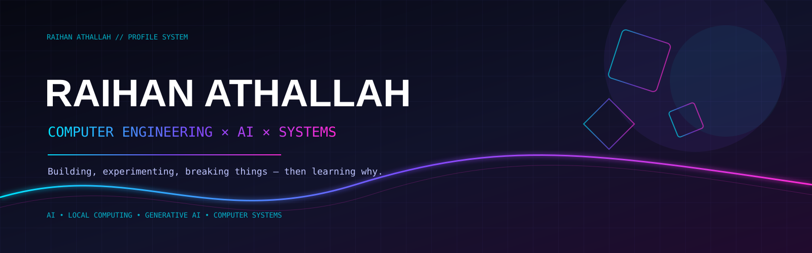

 

---

## ⚡ SYSTEM PROFILE

<table>
<tr>
<td width="50%" valign="top">

### 👤 Identity
**Raihan Athallah**  
Computer Engineering Student  
**Telkom University** · Bandung, Indonesia

> Exploring the intersection of software, AI, and computer systems.

</td>
<td width="50%" valign="top">

### 🎯 Current Focus
- 🤖 Artificial Intelligence
- 🧠 Local LLM & AI Agents
- 🎨 Generative AI
- ⚙️ Computer Systems
- 🌐 Networking & IoT
- 🛠️ Software Engineering

</td>
</tr>
</table>

---

## 🧠 AI / LOCAL COMPUTING

I enjoy experimenting with AI beyond simply calling an API — from **generative image workflows** to **local LLM inference and agent systems**.

---

## 🛠️ TECH MATRIX

**Languages**

**AI / Development**

**Systems / Infrastructure**

---

## 🚀 FEATURED PROJECTS

<table>
<tr>
<td width="50%" valign="top">

### 🤖 [StudyMate-AI](https://github.com/Rathallah03/StudyMate-AI)

LLM-based learning assistant built with **Python, Streamlit, and Gemini API**.

- 💬 Conversational learning
- 🧠 Chat history
- 🎯 Explanation / Summary / Quiz modes
- 🗣️ Adjustable response style

</td>
<td width="50%" valign="top">

### 🎮 [Gacha Inventory System](https://github.com/Rathallah03/gacha-inventory-system)

Python + CustomTkinter simulator with:

- 🎰 Pull & pity system
- 🎒 Inventory management
- ⭐ Constellation / duplicates
- 💾 Save & load
- 📜 Pull history

</td>
</tr>
<tr>
<td width="50%" valign="top">

### ☁️ [Sistem Retail Toko Elektronik](https://github.com/Rathallah03/sistem-retail-toko-elektronik)

Cloud-computing study project using a **3-tier virtual machine architecture**.

<code>Vagrant</code> · <code>Ansible</code> · <code>Nginx</code> · <code>Flask</code> · <code>MySQL</code>

</td>
<td width="50%" valign="top">

### 🎨 [ComfyUI](https://github.com/Rathallah03/ComfyUi)

Public workspace for **ComfyUI and generative-AI experimentation**, including workflows, custom nodes, model experiments, and image-generation pipelines.

</td>
</tr>
</table>

---

## 📚 LEARNING JOURNEY

~~~
Computer Engineering
        │
        ├── Computer Systems
        ├── Networking
        ├── Embedded / IoT
        │
        └── Artificial Intelligence
              ├── Linear Algebra
              ├── Probability & Statistics
              ├── Machine Learning
              ├── Generative AI
              └── Local LLM / AI Agents
~~~

---

## 🔭 CURRENTLY BUILDING

> **Learn → Experiment → Build → Break → Debug → Understand → Repeat**

~~~
[ AI / ML ]          ███████████████░░░
[ Local AI ]         ██████████████░░░░
[ Systems ]          ████████████░░░░░░
[ Networking ]       ██████████░░░░░░░░
[ IoT / Hardware ]   ████████░░░░░░░░░░
~~~

*Visual snapshot only — not formal skill ratings.*

---

## 📊 GITHUB ACTIVITY

---

## 🧩 A LITTLE ABOUT ME

~~~
🎓 Computer Engineering student
🤖 Interested in AI & intelligent systems
🎨 Generative-AI enthusiast
🧠 Curious about local models and AI agents
⚙️ I like understanding how systems work underneath
💻 Usually experimenting with something at 2 AM
~~~

### 「 BUILD SOMETHING. BREAK SOMETHING. LEARN SOMETHING. 」

---

Designed & maintained by <a href="https://github.com/Rathallah03">Rathallah03</a> · Computer Engineering × AI × Systems